# Evaluating Lp-Norm Scalarization Methods for Pareto Front Approximation in Multi-Objective Reinforcement Learning

**ECE 406 — Introduction to Multi-Objective Machine Learning**
**University of Rochester, Spring 2026**
**Authors:** Jiajun Wu, Venkatakrishnan V K
**Instructor:** Lisha Chen

> Code: [github.com/venkatKrishnan86/multi-objective-scalarization-techniques](https://github.com/venkatKrishnan86/multi-objective-scalarization-techniques)

---

## Problem Description

This project systematically evaluates how Lp-norm scalarization methods affect the quality and diversity of solutions learned in a Multi-Objective Reinforcement Learning (MORL) setting.

We train RL agents on the **Deep Sea Treasure** benchmark from [MO-Gymnasium](https://mo-gymnasium.farama.org/), using both:

- `deep-sea-treasure-v0` — convex Pareto front
- `deep-sea-treasure-concave-v0` — concave Pareto front

and sweep over the scalarization parameter:

$$p \in \{1, 2, 4, 8, \infty\}$$

where $p = 1$ recovers **linear scalarization** and $p = \infty$ recovers **Chebyshev (L∞) scalarization**.

---

## Background and Motivation

Many real-world decision-making problems require balancing multiple competing objectives simultaneously. Standard RL methods assume a single scalar reward, which encodes all preferences in advance and limits post-hoc explainability. MORL addresses this by modeling rewards as vectors and computing policies that represent diverse trade-offs among objectives.

In MORL, the agent receives a reward vector $\mathbf{r}_t \in \mathbb{R}^n$ at each time step, and the discounted cumulative (vector) return is:

$$\mathbf{G}_t = \sum_{k=t}^{T-1} \gamma^{k-t} \mathbf{r}_k$$

Because one policy may perform better on one objective but worse on another, the ordering between policies is only partial. A policy is **Pareto-optimal** if no other policy can improve one objective without worsening at least one other.

**Scalarization** is one of the most practical strategies in MORL: the vector return is collapsed into a scalar objective and standard RL is applied. However, the choice of scalarization function strongly influences which parts of the Pareto front can be recovered.

- **Linear scalarization** ($p=1$): easy to interpret and widely used, but can only recover *supported* (convex-hull) Pareto-optimal solutions. It fails to identify solutions in non-convex regions of the front.
- **Chebyshev scalarization** ($p=\infty$): provides a different geometric bias and can recover solutions in non-convex (concave) regions.
- **Lp-norm scalarization** ($1 < p < \infty$): interpolates between the two extremes, offering a continuum of biases.

The Deep Sea Treasure environment is ideal for this study because:
1. The reward function is 2-dimensional, making the Pareto front easy to visualize.
2. Both convex and concave Pareto front variants are available, allowing direct comparison against theoretical predictions from multi-objective optimization.

---

## Environment

| Property | Value |
|---|---|
| Environment | Deep Sea Treasure (MO-Gymnasium) |
| Variants | `deep-sea-treasure-v0` (convex), `deep-sea-treasure-concave-v0` (concave) |
| Objectives | (1) Treasure value, (2) Time penalty (negative reward per step) |
| Scalarization parameter | $p \in \{1, 2, 4, 8, \infty\}$ |
| State space | Discrete grid (submarine position) |
| Action space | 4 movements (up, down, left, right) |
| Episode length | Up to 100 steps |

Deep Sea Treasure is a classical MORL problem in which an agent controls a submarine navigating a two-dimensional grid. The two variants below differ in the distribution of treasure values, which induces different Pareto-front geometries. Both variants have **known Pareto fronts**, enabling exact utopian-point computation and normalized hypervolume evaluation.

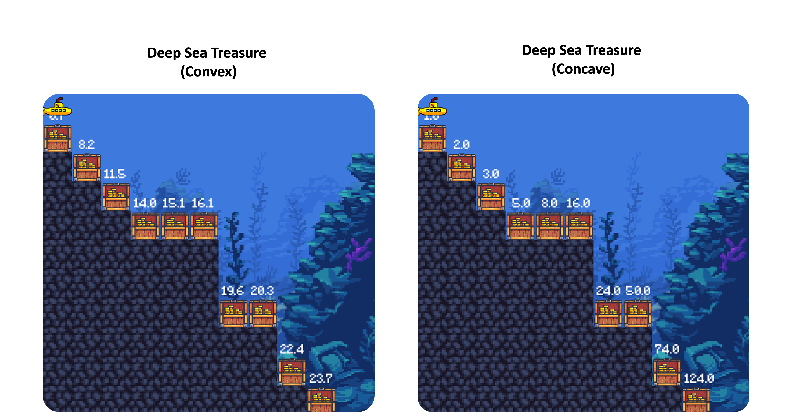

---

## Methodology

### Utopian Point

The utopian point $\mathbf{G}^\star \in \mathbb{R}^n$ represents the theoretical optimum in each objective dimension:

$$G^\star_i = \max_\pi G_i(\pi), \quad \forall i \in [n]$$

By definition, for any achievable return vector $\mathbf{G}$:

$$\mathbf{G}^\star - \mathbf{G} \in \mathbb{R}^n_{\geq 0}$$

i.e., the difference always lies in the non-negative orthant. $\mathbf{G}^\star$ is computed once from the environment's true Pareto front and cached to `outputs/<env_name>/utopian.npy`.

### Pareto Front

A return vector $\mathbf{G}^k$ is **non-dominated** if there does not exist another vector $\mathbf{G}$ such that $\mathbf{G} \succeq \mathbf{G}^k$ and $\mathbf{G} \neq \mathbf{G}^k$. The Pareto front $\mathcal{P}$ is the set of all non-dominated return vectors:

$$\mathcal{P} = \left\{ \mathbf{G}^k \in \mathbb{R}^n \;\middle|\; \nexists\, \mathbf{G} \in \mathbb{R}^n \text{ s.t. } \mathbf{G} - \mathbf{G}^k \in \mathbb{R}^n_{\geq 0} \setminus \{0\} \right\}$$

### Lp Scalarization

For a weight vector $\mathbf{w} \succ 0$ (strictly positive orthant, $w_i > 0$ for all $i$) and a return vector $\mathbf{G}$, the scalarized utility function is:

$$u(\mathbf{G}) = \left\| \operatorname{diag}(\mathbf{w})\,(\mathbf{G}^\star - \mathbf{G}) \right\|_p = \left( \sum_i \left| w_i \left( G^\star_i - G_i \right) \right|^p \right)^{1/p}$$

with the Chebyshev limit ($p \to \infty$):

$$u(\mathbf{G}) = \max_i \left| w_i \left( G^\star_i - G_i \right) \right|$$

This is a weighted distance from the utopian point; minimizing $u(\mathbf{G})$ maximizes how close the achieved return is to the ideal.

### SER vs ESR

We adopt the **Scalarized Expected Returns (SER)** objective rather than Expected Scalarized Returns (ESR). Under SER, the agent first accumulates the full episode's cumulative vector return $\mathbf{G}_0$ and then scalarizes:

$$J(\pi_\mathbf{w}) = u\!\left(\mathbb{E}[\mathbf{G}(\pi_\mathbf{w})]\right)$$

Under ESR the scalarization would be applied per-step. In Deep Sea Treasure, all intermediate steps yield the same non-terminal reward $[0, -1]$; ESR collapses every non-terminal step to the same scalar, destroying credit-assignment signal. SER preserves the full vector structure until the episode ends. Importantly, SER and ESR are equivalent **only** for linear scalarization ($p = 1$), since the utility function $u(\cdot)$ is non-linear for $p > 1$; in general, $u(\mathbb{E}[\mathbf{G}]) \neq \mathbb{E}[u(\mathbf{G})]$.

### Weight Selection

We construct a discrete set of weight vectors from the 2-D simplex $\Delta^2$, linearly spaced as:

$$\mathbf{w} \in \{(w_1, w_2) \mid w_1 + w_2 = 1,\; w_1 \in \{0.05, 0.10, \ldots, 0.95\}\}$$

excluding the degenerate endpoints $(1, 0)$ and $(0, 1)$. This yields **38 uniformly distributed preference vectors** over the simplex. A separate policy is trained independently for each weight vector — no parameter sharing across weights.

### Agents

We train two families of agents for each $(p, \mathbf{w})$ configuration:

- **Tabular Q-learning** — maintains a table $Q[s, \text{reward-dim}, \text{action}]$ of expected cumulative vector rewards. After each episode, all state–action pairs are updated via first-visit returns (vector returns, never scalarized during learning). Scalarization enters only at action selection, where the action minimising $u(Q[s, :, \cdot])$ is chosen. An $\varepsilon$-greedy policy is used during training.

- **Cross-Entropy Method (CEM)** — a population-based policy-search algorithm. Each iteration samples $N$ candidate policy parameters $\theta_i \sim \mathcal{N}(\mu, \Sigma)$, evaluates full episode rollouts, computes the cumulative vector return $\mathbf{G}_0$ for each rollout, scalarizes with $u(\cdot)$, and selects the top-$k$ elite rollouts (lowest $L_p$-distance to $\mathbf{G}^\star$). The distribution is then updated via the elite empirical mean and covariance:

$$\mu \leftarrow \frac{1}{|\mathcal{E}|}\sum_{\theta_i \in \mathcal{E}} \theta_i, \qquad \Sigma \leftarrow \frac{1}{|\mathcal{E}|}\sum_{\theta_i \in \mathcal{E}} (\theta_i - \mu)(\theta_i - \mu)^\top$$

### Evaluation Metric: Hypervolume

We evaluate the quality of the learned policy set using the **hypervolume (HV)** indicator [2], which measures the volume of the objective space dominated by a set of solutions with respect to a reference point $\mathbf{G}^{\text{ref}}$ chosen strictly below all achievable returns:

$$\text{HV}(S) = \lambda\!\left( \bigcup_{\mathbf{G} \in S} \left\{ \mathbf{x} \in \mathbb{R}^n \;\middle|\; \mathbf{G}^{\text{ref}} \preceq \mathbf{x} \preceq \mathbf{G} \right\} \right)$$

where $\lambda(\cdot)$ denotes the **Lebesgue measure** (volume), and each set $\{\mathbf{x} \mid \mathbf{G}^{\text{ref}} \preceq \mathbf{x} \preceq \mathbf{G}\}$ describes the points contained in the **hyper-rectangle** anchored at $\mathbf{G}^{\text{ref}}$ and extending to $\mathbf{G}$ component-wise. The hypervolume is therefore the total volume of the union of these hyper-rectangles, one per solution in $S$. In our two-dimensional setting this reduces to a union of axis-aligned rectangles, computed efficiently via a sweepline algorithm.

To enable comparison across environments, we compute the **normalized hypervolume**:

$$\text{HV}_{\text{norm}}(S) = \frac{\text{HV}(S)}{\text{HV}(\mathcal{P})}$$

where $\mathcal{P}$ is the true Pareto front. Since $\mathcal{P}$ is known exactly in our setting, $\text{HV}(\mathcal{P})$ serves as a fixed normalization constant, ensuring $\text{HV}_{\text{norm}} \in (0, 1]$.

---

## Project Structure

```
.
├── pyproject.toml          # Project dependencies (managed with uv)
├── README.md
├── agent.py                # BaseAgent, TabularAgent, CEMAgent, DQNAgent
├── dqn.py                  # MultiObjectiveDQN network architecture
├── utils.py                # Scalarization functions, ReplayBuffer, utopian computation
├── train.py                # Sweep training script (env × p × weight)
├── evaluate.py             # Hypervolume computation and Pareto evaluation plots
├── plots.py                # Pareto front and hypervolume bar chart visualization
├── example_plots/          # Representative result figures (used in README)
├── documents/              # Reports, notes, and references
└── MOML_Final_Project_Proposal.pdf
```

---

## Setup

This project uses [uv](https://github.com/astral-sh/uv) for environment management.

```bash
uv sync
source .venv/bin/activate
```

---

## Dependencies

| Package | Purpose |
|---|---|
| `mo-gymnasium` | Deep Sea Treasure MORL environment |
| `torch` | Neural network policies |
| `numpy` | Array operations |
| `matplotlib` / `seaborn` | Visualization |
| `scikit-learn` | Evaluation utilities |
| `scipy` | Numerical routines |

---

## Results

Normalized hypervolume bar charts summarising all $(p, \text{model})$ combinations are shown below.

| Convex DST | Concave DST |
|:---:|:---:|
| 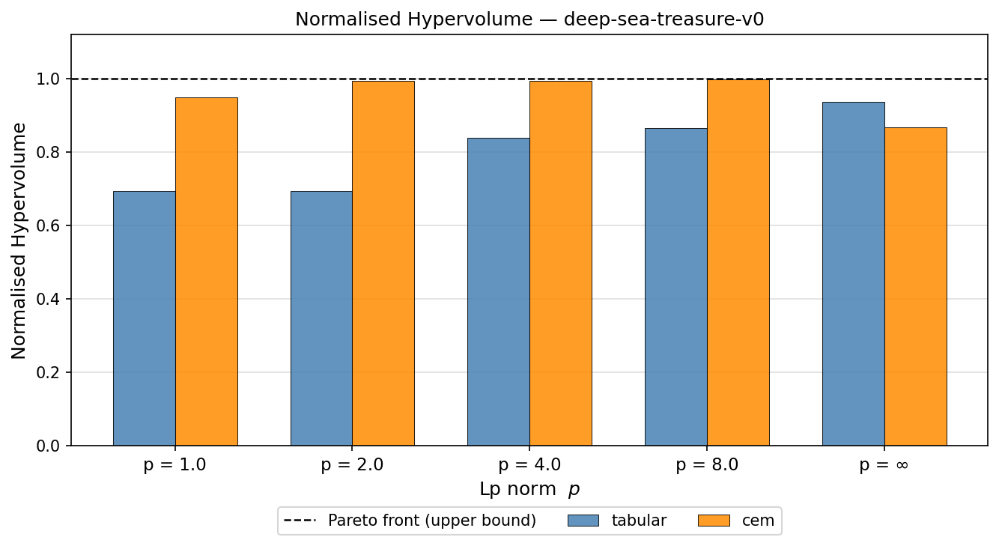 | 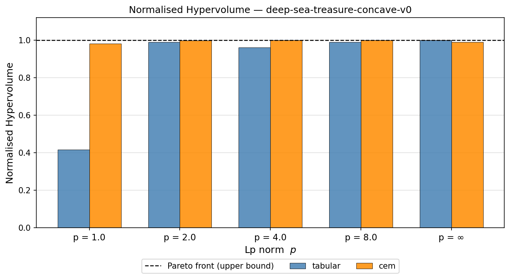 |

---

Each plot shows the true Pareto front (thick black staircase with **×** markers), the utopian point $\mathbf{G}^\star$ (blue star), the best achieved return per weight vector (**red** hollow circle = on Pareto front, **grey** hollow circle = suboptimal dominated solution), and the Lp-norm scalarization level-set curve (red dashed) passing through each on-front achieved point.

### Convex Pareto Front (`deep-sea-treasure-v0`) — Tabular Q-learning

| $p = 1$ (Linear) | $p = 2$ (Euclidean) | $p = \infty$ (Chebyshev) |
|:---:|:---:|:---:|
| 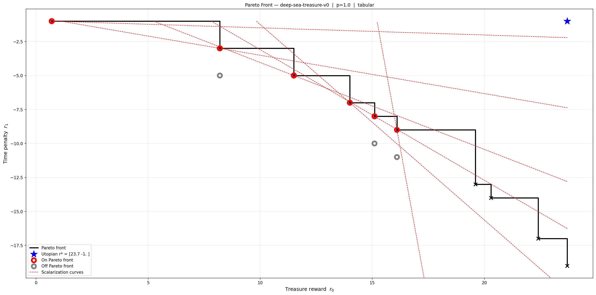 | 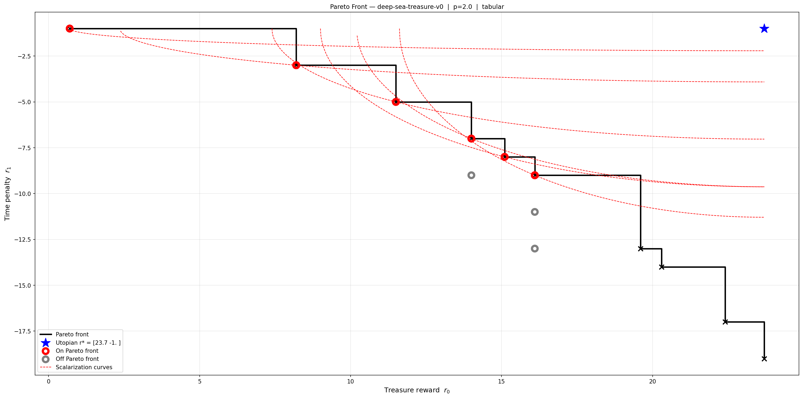 | 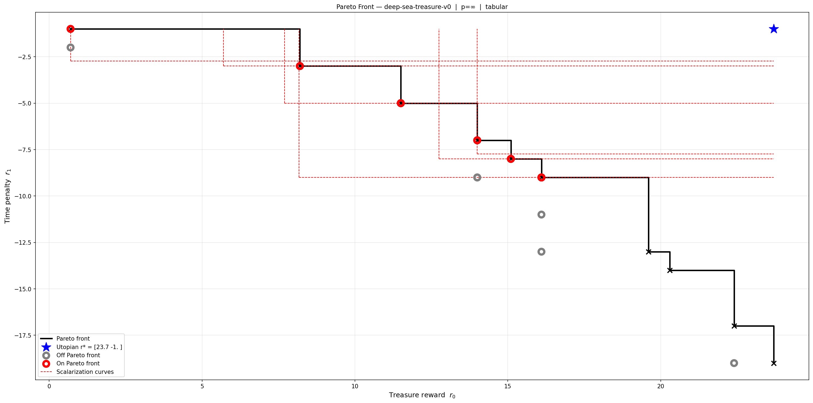 |

**Observation:** On the convex front, all three norms recover most Pareto-optimal solutions. Linear scalarization ($p=1$) produces diagonal level-set curves and struggles with weight vectors targeting dense mid-range solutions. Chebyshev ($p=\infty$) produces L-shaped contours that visibly "pin" each solution to a corner of the front, achieving stronger coverage.

---

### Convex Pareto Front (`deep-sea-treasure-v0`) — CEM

| $p = 2$ (Euclidean) |
|:---:|
| 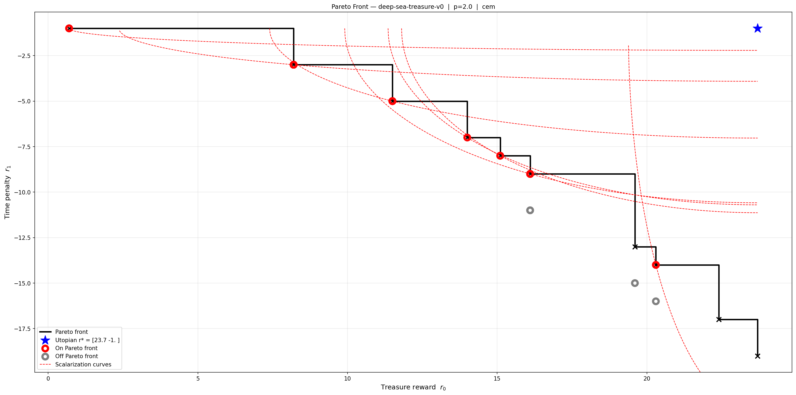 |

---

### Concave Pareto Front (`deep-sea-treasure-concave-v0`) — Tabular Q-learning

| $p = 1$ (Linear) | $p = 2$ (Euclidean) | $p = \infty$ (Chebyshev) |
|:---:|:---:|:---:|
| 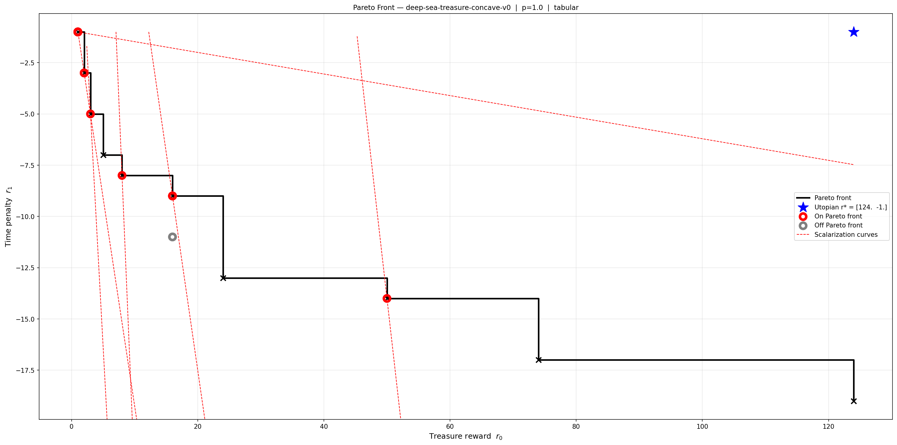 | 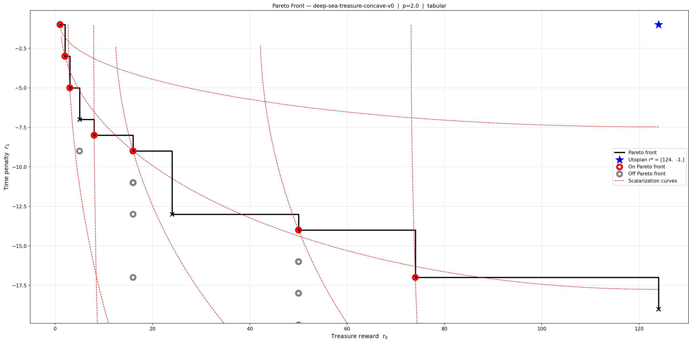 | 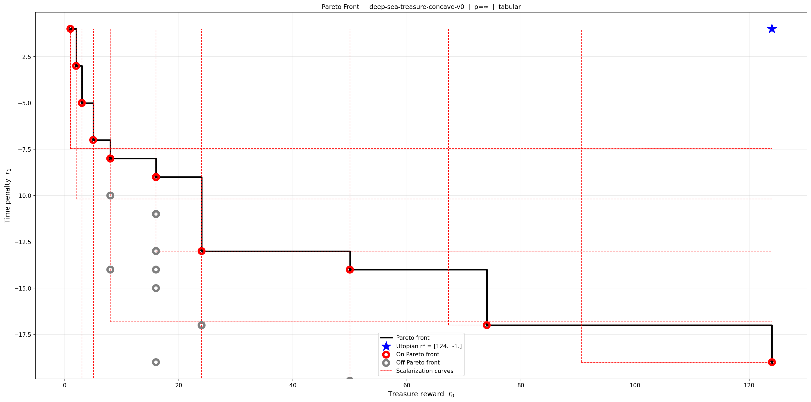 |

**Observation:** On the concave front, linear scalarization ($p=1$) fails markedly — diagonal level-set curves cannot be tangent to concave regions, so many weight vectors collapse to the same supported extreme points and grey circles cluster away from the front. Higher-order norms ($p \geq 2$) and Chebyshev scalarization recover significantly more of the concave Pareto front by using curved or L-shaped contours that can be tangent to non-convex regions. Tabular Q-learning with Chebyshev scalarization achieves particularly strong coverage, suggesting that the structured nature of the Chebyshev objective provides a more informative learning signal.

---

### Concave Pareto Front (`deep-sea-treasure-concave-v0`) — CEM

| $p = 2$ (Euclidean) | $p = \infty$ (Chebyshev) |
|:---:|:---:|
| 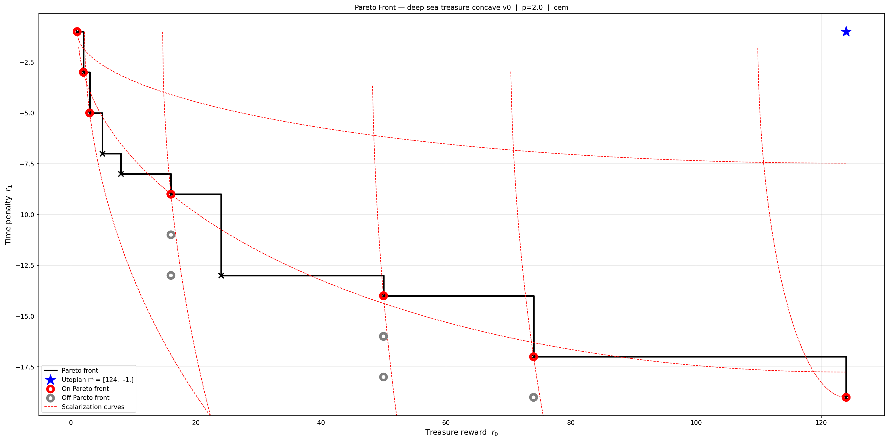 | 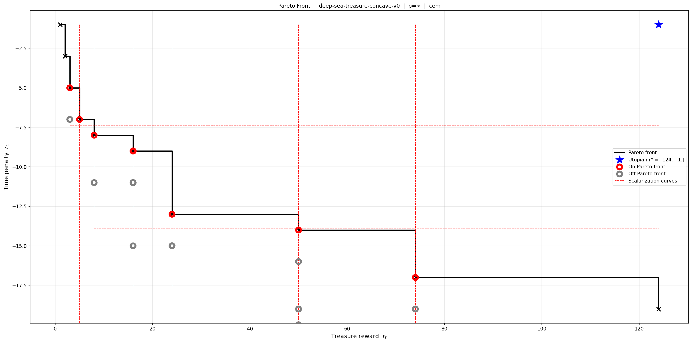 |

**Observation:** CEM demonstrates comparatively better performance than Tabular Q-learning under **linear scalarization** ($p=1$). Because CEM is a population-based stochastic optimizer, it maintains a broader distribution over policies that partially mitigates the representational bias of linear scalarization — even when the scalarization geometry cannot reach concave Pareto regions, CEM's exploration still produces partial coverage. However, under **Chebyshev scalarization** ($p=\infty$), Tabular Q-learning's exact Q-table gives it the advantage: CEM's population-based search introduces variance and may converge to suboptimal policies before the L-shaped contour aligns with the correct Pareto point.

---

## Conclusion

The results underscore that scalarization is not merely a design choice but a central factor shaping the success of MORL algorithms. Linear scalarization is fundamentally restricted to the convex hull of the objective space and fails on concave Pareto fronts. Chebyshev scalarization is not restricted to convex combinations and successfully recovers Pareto-optimal solutions in both convex and concave regions. The interaction between scalarization geometry and optimization algorithm matters: Tabular Q-learning benefits most from Chebyshev's structured objective, while CEM's stochastic exploration partially compensates for linear scalarization's limitations.

All experiments are conducted in environments with discrete action spaces and small grid-based state representations. Future work should investigate scalability to continuous control tasks requiring function approximation (e.g., deep neural networks), and explore adaptive or hybrid scalarization strategies that dynamically adjust to the inferred geometry of the Pareto front.

---

## LLM Usage Disclosure

The completion of this project was aided by the following LLMs:
- **Coding:** Claude 4.6 Sonnet (Anthropic) — code generation and documentation.
- **Report writing:** ChatGPT 5 (OpenAI) — grammar enhancement and writing improvement.

All content has been verified by us manually for accuracy, originality, and completeness. Any errors are solely our responsibility.

---

## References

[1] Florian Felten, Lucas N. Alegre, Ann Nowé, Ana L. C. Bazzan, El Ghazali Talbi, Grégoire Danoy, and Bruno C. da Silva. *A toolkit for reliable benchmarking and research in multi-objective reinforcement learning.* In Proceedings of the 37th Conference on Neural Information Processing Systems (NeurIPS 2023), 2023.

[2] Conor F. Hayes, Roxana Rădulescu, Eugenio Bargiacchi, Johan Källström, Matthew Macfarlane, Mathieu Reymond, Timothy Verstraeten, Luisa M. Zintgraf, Richard Dazeley, Fredrik Heintz, et al. *A practical guide to multi-objective reinforcement learning and planning.* Autonomous Agents and Multi-Agent Systems, 36(1):26, 2022.

[3] Diederik M. Roijers, Peter Vamplew, Shimon Whiteson, and Richard Dazeley. *A survey of multi-objective sequential decision-making.* Journal of Artificial Intelligence Research, 48:67–113, 2013.

[4] Richard S. Sutton and Andrew G. Barto. *Reinforcement Learning: An Introduction.* MIT Press, Cambridge, MA, 2nd edition, 2018.

[5] Mark Towers, Ariel Kwiatkowski, Jordan Terry, John U Balis, Gianluca De Cola, Tristan Deleu, Manuel Goulão, Andreas Kallinteris, Markus Krimmel, Arjun KG, et al. *Gymnasium: A standard interface for reinforcement learning environments.* arXiv preprint arXiv:2407.17032, 2024.
